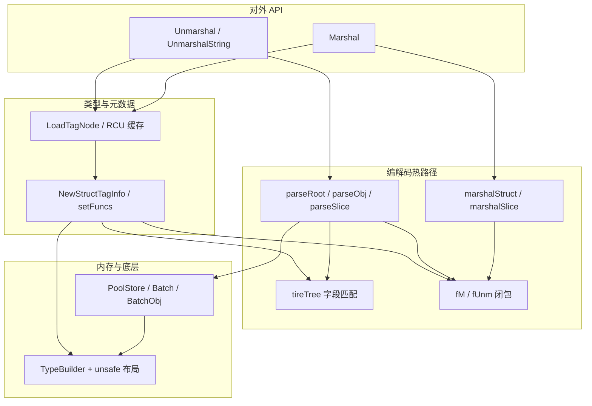

# json
Trying to implement the fastest JSON library for golang.

# 前言
本项目已存在 [blog](https://github.com/lxt1045/blog/main/sample/json/json) 仓库
下存在半年多了，一直没有精力整理。

当前还有一些特性没有实现，且许多边界条件还未覆盖。

---

以下五节直接回答常见问题：**设计上有何可取之处**、**与别的 JSON 库比优劣**、**值不值得推广**、**推广还缺什么**、**整体架构如何组织**。细节实现与踩坑见 [`work.md`](./work.md)。

---

## 1. 设计思路上有什么可取之处？

**一句话**：把「类型长什么样」在**第一次遇到该类型时**就算清楚并缓存起来，真正解析/生成 JSON 时尽量只做**线性扫描内存 + 特化小函数 + 可控分配**，而不是每次都完整走一遍通用反射。

具体可取点：

| 思路 | 作用 |
|------|------|
| **类型级元数据图 `TagInfo` + RCU 全局缓存** | 每个 `reflect.Type` 只解析一次字段、`json` 标签、偏移；后续调用只查表。 |
| **对象键用 Trie（`tireTree`）** | 在输入串上按字节推进即可落到字段节点，适合字段多、前缀相近的 struct，减少「每键一次 map 或多次字符串比较」的通用路径。 |
| **每字段一对 `fM` / `fUnm` 闭包** | 相当于按类型组合出的**微型代码生成**：bool、整型、指针层级、slice、嵌套 struct 等在构建期就选好策略，热路径避免巨型 `switch Kind`。 |
| **`Batch` / `BatchObj` + `TypeBuilder` 合成布局** | 用 `reflect.StructOf` 拼出指针块布局，配合 `unsafe` 批量拿内存，减少大量 `*T` 各自 `new` 的开销。 |
| **`UnmarshalString` 等形态** | 在 `string` 上扫描，部分路径减少与 `[]byte` 的来回拷贝（需注意生命周期与安全性）。 |
| **工具 API（如 `MarshalIndent`、`Valid`）** | 在保持主路径风格的前提下，补齐常见「美化 / 校验」需求。 |

这些点组合起来，本质是 **「冷路径反射一次，热路径接近手写」**；思路可迁移到 Protobuf、MsgPack 等「绑定到固定 Go 类型」的编解码器设计里。

---

## 2. 相对于其他 JSON 库有什么优劣？

**默认对比场景**：JSON **绑定到事先声明好的 struct**（本库主优化目标），而不是纯动态 `map[string]interface{}` 或流式超大文档。

| 维度 | 本库 | `encoding/json` | Sonic / jsoniter 等 |
|------|------|-----------------|---------------------|
| **延迟与分配（struct 绑定）** | 仓库基准下往往很省；设计目标就是这条路径 | 通用、稳，但通用路径成本高 | 通常也很快；实现手段各异（SIMD、JIT、代码生成等） |
| **行为与文档** | 子集 + 演进中；需对照标准库逐项确认 | 事实标准 | 成熟库文档与社区经验更多 |
| **API 完整度** | 无完整 `Decoder`/`Encoder`/Token 面 | 全 | 多数更接近「可替换标准库」 |
| **升级与可移植** | **强依赖** `unsafe`、`go:linkname`、运行时布局；Go 大版本可能踩 GC/checkptr | 低维护成本 | 因库而异（如架构限制） |
| **可读性与招人成本** | 高；要懂内存模型与 runtime | 低 | 中 |

**优势归纳**：在「类型稳定、QPS 高、JSON 已占 profiling 大头」时，有机会用 **Trie + 特化闭包 + 池化** 换明显 CPU/分配收益；实现本身是很好的 **Go 高性能系统编程** 样例。

**劣势归纳**：很难声称与 `encoding/json` **处处语义一致**；功能面、工具链、长期兼容承诺若不到位，就不适合作为**无评估的默认依赖**。

---

## 3. 有推广的必要吗？

**不必做成「人人都要用的标准库替代品」，但值得在合适的圈子里被知道。**

- **值得推广**：已证明 JSON 是瓶颈、且以固定 struct 为主的团队；需要参考「如何把反射挪出热路径」的库作者/讲师；对 runtime / `unsafe` 与序列化实现感兴趣的学习者。  
- **不宜强推**：默认业务 CRUD、团队更在意**可维护性与行为一致性**时，仍应优先 `encoding/json` 或生态成熟的高性能库。

更准确的定位：**偏研究与工程验证的高性能 struct 绑定实现**，附带一套**可复用的架构模式**（缓存 Tag、Trie、池化），而不是「下一个全民 JSON 包」。

---

## 4. 如果要推广，还缺少什么？

从「能跑、能测」到「别人敢上生产、愿意替你背书」，常见缺口如下（大致按优先级）：

1. **与 `encoding/json` 的语义对齐**：成体系的对比测试（含边界类型、`json.Number`、未知字段策略、转义/HTML 等），并写清**差异清单**。  
2. **API 面**：`Decoder` / `Encoder`、流式、Token、更丰富的错误定位（偏移、字段路径）。  
3. **质量工程**：多 Go 版本 CI、`-race` / fuzz、固定语料回归；benchmark 注明机器、版本、数据集，并补充**真实业务 JSON** 抽样。  
4. **治理**：semver、CHANGELOG、安全披露与支持矩阵（哪些 Go 版本/平台/构建标签官方支持）。  
5. **文档**：「支持类型与标签矩阵」、不适用场景、性能调优与**何时应退回标准库**。  
6. **宣传口径**：强调场景与条件，避免未限定前提的「全面最快」表述，反而利于建立信任。

---

## 5. 整个库的架构（如何串起来）

**分层理解**：

1. **入口层**（`api.go`）：`Marshal` / `Unmarshal` / `UnmarshalString`；错误多经 `recover` 包装；根对象对应 `PoolStore`。  
2. **元数据层**（`pool.go` + `struct_tag.go`）：按类型哈希 `LoadTagNode`；未命中则 `NewStructTagInfo` 建 `TagInfo` 树、`setFuncs` 挂上各字段的 `fM`/`fUnm`；递归 struct 等特殊情况在构建期或运行时代理中处理。  
3. **查找层**（`tire_tree.go`）：每个 struct 的字段名建成 Trie，供反序列化时匹配 `"name":`。  
4. **编解码热路径**（`unmarshal.go`、`marshal.go` + `func_marshal_unmarshal.go` 等）：`parseRoot` → `parseObj` / `parseSlice` … 驱动 `fUnm`；`marshalStruct` 等驱动 `fM`。  
5. **内存与底层**（`pool.go`、`type_builder.go`、`go_type.go`、`stubs.go`）：`Batch`/`BatchObj`、`PoolStore` 指针池基址、`TypeBuilder` 合成 struct、`unsafe` 与 `linkname`（**对 Go 版本敏感**）。  
6. **工具**（`extra.go`）：`MarshalIndent`、`Valid` 等。

**单次 Unmarshal（极简数据流）**：取根 `TagInfo` → 组 `PoolStore` → `parseRoot` → 遇对象则 `parseObj` + Trie 命中字段 → 调该字段 `fUnm`（可能改 `store.obj`、从指针池取块）。

**单次 Marshal（极简数据流）**：取根 `TagInfo` → 拿输出缓冲 → `marshalStruct` 遍历子节点 → 各字段 `fM` 写 JSON。

| 文件（示例） | 职责摘要 |
|--------------|----------|
| `api.go` | 对外 API 与根级 `PoolStore` 准备 |
| `pool.go` | 类型缓存、池、`PoolStore` |
| `struct_tag.go` | `TagInfo` 树与 `setFuncs` |
| `tire_tree.go` | 字段名 Trie |
| `type_builder.go` | 合成 struct 与偏移 |
| `func_marshal_unmarshal.go` 等 | `fM` / `fUnm` 工厂与实现 |
| `unmarshal.go` / `marshal.go` | 解析与写出主循环 |
| `extra.go` | 缩进、校验等 |
| `go_type.go`、`stubs.go` | 底层类型与 runtime 辅助 |

**模块依赖示意**：



---

# 性能表现
以纯 Go 语言实现，在性能上全面超越 SIMD 实现的 [sonic](https://github.com/bytedance/sonic)。
## 1. sonic 的测试用例
### 1.1 执行 [sonic](https://github.com/bytedance/sonic) 仓库下的 small JSON 数据，
[单测源码在这](https://github.com/lxt1045/json/blob/main/bench_test.go#L350), 结果如下：
```sh
BenchmarkSmallBinding/decode-lxt
BenchmarkSmallBinding/decode-lxt-12         	  986773	      1019 ns/op	 358.32 MB/s	     484 B/op	       1 allocs/op
BenchmarkSmallBinding/decode-sonic
BenchmarkSmallBinding/decode-sonic-12       	  675369	      1636 ns/op	 223.08 MB/s	    1394 B/op	       7 allocs/op
BenchmarkSmallBinding/decode-parallel-lxt
BenchmarkSmallBinding/decode-parallel-lxt-12         	 4173538	       279.9 ns/op	1304.23 MB/s	     483 B/op	       1 allocs/op
BenchmarkSmallBinding/decode-parallel-sonic
BenchmarkSmallBinding/decode-parallel-sonic-12       	 3362064	       346.4 ns/op	1053.63 MB/s	    1398 B/op	       7 allocs/op
BenchmarkSmallBinding/encode-lxt
BenchmarkSmallBinding/encode-lxt-12                  	 1509781	       677.2 ns/op	 539.01 MB/s	     321 B/op	       0 allocs/op
BenchmarkSmallBinding/encode-sonic
BenchmarkSmallBinding/encode-sonic-12                	 1517035	       714.7 ns/op	 510.73 MB/s	     458 B/op	       4 allocs/op
BenchmarkSmallBinding/encode-parallel-lxt
BenchmarkSmallBinding/encode-parallel-lxt-12         	 8529007	       140.2 ns/op	2603.04 MB/s	     319 B/op	       0 allocs/op
BenchmarkSmallBinding/encode-parallel-sonic
BenchmarkSmallBinding/encode-parallel-sonic-12       	 8699536	       140.5 ns/op	2597.92 MB/s	     461 B/op	       4 allocs/op
```


### 1.2 执行 [sonic](https://github.com/bytedance/sonic) 仓库下的 medium JSON 数据，
[单测源码在这](https://github.com/lxt1045/json/blob/main/bench_test.go#L552), 结果如下：
```sh
BenchmarkMediumBinding/decode-lxt
BenchmarkMediumBinding/decode-lxt-12         	   88701	     13341 ns/op	 832.02 MB/s	    5757 B/op	      23 allocs/op
BenchmarkMediumBinding/decode-sonic
BenchmarkMediumBinding/decode-sonic-12       	   49826	     26159 ns/op	 424.33 MB/s	   24215 B/op	      34 allocs/op
BenchmarkMediumBinding/decode-parallel-lxt
BenchmarkMediumBinding/decode-parallel-lxt-12         	  312424	      3322 ns/op	3341.32 MB/s	    5795 B/op	      23 allocs/op
BenchmarkMediumBinding/decode-parallel-sonic
BenchmarkMediumBinding/decode-parallel-sonic-12       	  222912	      4962 ns/op	2237.22 MB/s	   24231 B/op	      34 allocs/op
BenchmarkMediumBinding/encode-lxt
BenchmarkMediumBinding/encode-lxt-12                  	  279264	      4051 ns/op	2739.95 MB/s	    8328 B/op	       0 allocs/op
BenchmarkMediumBinding/encode-sonic
BenchmarkMediumBinding/encode-sonic-12                	  246520	      4687 ns/op	2368.36 MB/s	    9585 B/op	       4 allocs/op
BenchmarkMediumBinding/encode-parallel-lxt
BenchmarkMediumBinding/encode-parallel-lxt-12         	  653260	      1600 ns/op	6935.93 MB/s	    8321 B/op	       0 allocs/op
BenchmarkMediumBinding/encode-parallel-sonic
BenchmarkMediumBinding/encode-parallel-sonic-12       	  931518	      1079 ns/op	10287.75 MB/s	    9764 B/op	       4 allocs/op
```

### 1.3 执行 [sonic](https://github.com/bytedance/sonic) 仓库下的 large JSON 数据，
[单测源码在这](https://github.com/lxt1045/json/blob/main/bench_test.go#L754), 结果如下：
```sh
BenchmarkLargeBinding/decode-lxt
BenchmarkLargeBinding/decode-lxt-12         	    1526	    772026 ns/op	 818.00 MB/s	  334450 B/op	    1469 allocs/op
BenchmarkLargeBinding/decode-sonic
BenchmarkLargeBinding/decode-sonic-12       	     985	   1299304 ns/op	 486.04 MB/s	  464453 B/op	    1682 allocs/op
BenchmarkLargeBinding/decode-parallel-lxt
BenchmarkLargeBinding/decode-parallel-lxt-12         	    7350	    174831 ns/op	3612.14 MB/s	  326045 B/op	    1469 allocs/op
BenchmarkLargeBinding/decode-parallel-sonic
BenchmarkLargeBinding/decode-parallel-sonic-12       	    6112	    189034 ns/op	3340.75 MB/s	  464345 B/op	    1682 allocs/op
BenchmarkLargeBinding/encode-lxt
BenchmarkLargeBinding/encode-lxt-12                  	    9457	    126598 ns/op	4988.34 MB/s	  262233 B/op	       0 allocs/op
BenchmarkLargeBinding/encode-sonic
BenchmarkLargeBinding/encode-sonic-12                	    7723	    151450 ns/op	4169.79 MB/s	  262362 B/op	       4 allocs/op
BenchmarkLargeBinding/encode-parallel-lxt
BenchmarkLargeBinding/encode-parallel-lxt-12         	   29104	     53317 ns/op	11844.60 MB/s	  262042 B/op	       0 allocs/op
BenchmarkLargeBinding/encode-parallel-sonic
BenchmarkLargeBinding/encode-parallel-sonic-12       	   32044	     44517 ns/op	14186.04 MB/s	  262337 B/op	       4 allocs/op
```

有以上结果可知，在性能上此 JSON 库已经超越 [sonic](https://github.com/bytedance/sonic) 。

## 2. 不同 struct 成员类型测试用例

[测试用例源码在这里](https://github.com/lxt1045/json/blob/main/bench_test.go#L217)

测试结果如下：
```sh
BenchmarkUnmarshalType/uint-10-lxt
BenchmarkUnmarshalType/uint-10-lxt-12         	 3349932	       361.3 ns/op	 473.35 MB/s	       0 B/op	       0 allocs/op
BenchmarkUnmarshalType/uint-10-sonic
BenchmarkUnmarshalType/uint-10-sonic-12       	 2149837	       479.3 ns/op	 356.79 MB/s	       0 B/op	       0 allocs/op
BenchmarkUnmarshalType/Marshal-uint-10-lxt
BenchmarkUnmarshalType/Marshal-uint-10-lxt-12 	 4923214	       242.5 ns/op	 705.22 MB/s	     155 B/op	       0 allocs/op
BenchmarkUnmarshalType/Marshal-uint-10-sonic
BenchmarkUnmarshalType/Marshal-uint-10-sonic-12         	 4302016	       263.9 ns/op	 648.04 MB/s	     246 B/op	       4 allocs/op
BenchmarkUnmarshalType/*uint-10-lxt
BenchmarkUnmarshalType/*uint-10-lxt-12                  	 2543614	       407.2 ns/op	 419.90 MB/s	      80 B/op	       0 allocs/op
BenchmarkUnmarshalType/*uint-10-sonic
BenchmarkUnmarshalType/*uint-10-sonic-12                	 2036256	       527.6 ns/op	 324.08 MB/s	       0 B/op	       0 allocs/op
BenchmarkUnmarshalType/Marshal-*uint-10-lxt
BenchmarkUnmarshalType/Marshal-*uint-10-lxt-12          	 4739866	       251.1 ns/op	 681.12 MB/s	     153 B/op	       0 allocs/op
BenchmarkUnmarshalType/Marshal-*uint-10-sonic
BenchmarkUnmarshalType/Marshal-*uint-10-sonic-12        	 3007965	       333.0 ns/op	 513.45 MB/s	     247 B/op	       4 allocs/op
BenchmarkUnmarshalType/int8-10-lxt
BenchmarkUnmarshalType/int8-10-lxt-12                   	 4685821	       286.4 ns/op	 457.43 MB/s	       0 B/op	       0 allocs/op
BenchmarkUnmarshalType/int8-10-sonic
BenchmarkUnmarshalType/int8-10-sonic-12                 	 2468440	       454.1 ns/op	 288.47 MB/s	       0 B/op	       0 allocs/op
BenchmarkUnmarshalType/Marshal-int8-10-lxt
BenchmarkUnmarshalType/Marshal-int8-10-lxt-12           	 3337285	       352.8 ns/op	 371.36 MB/s	     236 B/op	       0 allocs/op
BenchmarkUnmarshalType/Marshal-int8-10-sonic
BenchmarkUnmarshalType/Marshal-int8-10-sonic-12         	 4428140	       249.5 ns/op	 524.96 MB/s	     215 B/op	       4 allocs/op
BenchmarkUnmarshalType/int-10-lxt
BenchmarkUnmarshalType/int-10-lxt-12                    	 3962656	       297.2 ns/op	 575.30 MB/s	       0 B/op	       0 allocs/op
BenchmarkUnmarshalType/int-10-sonic
BenchmarkUnmarshalType/int-10-sonic-12                  	 2211376	       464.2 ns/op	 368.39 MB/s	       0 B/op	       0 allocs/op
BenchmarkUnmarshalType/Marshal-int-10-lxt
BenchmarkUnmarshalType/Marshal-int-10-lxt-12            	 3302372	       316.7 ns/op	 539.87 MB/s	     154 B/op	       0 allocs/op
BenchmarkUnmarshalType/Marshal-int-10-sonic
BenchmarkUnmarshalType/Marshal-int-10-sonic-12          	 4071799	       274.1 ns/op	 623.93 MB/s	     248 B/op	       4 allocs/op
BenchmarkUnmarshalType/bool-10-lxt
BenchmarkUnmarshalType/bool-10-lxt-12                   	 4360530	       241.0 ns/op	 626.57 MB/s	       0 B/op	       0 allocs/op
BenchmarkUnmarshalType/bool-10-sonic
BenchmarkUnmarshalType/bool-10-sonic-12                 	 2759778	       392.4 ns/op	 384.80 MB/s	       0 B/op	       0 allocs/op
BenchmarkUnmarshalType/Marshal-bool-10-lxt
BenchmarkUnmarshalType/Marshal-bool-10-lxt-12           	 8728110	       136.4 ns/op	1107.24 MB/s	     136 B/op	       0 allocs/op
BenchmarkUnmarshalType/Marshal-bool-10-sonic
BenchmarkUnmarshalType/Marshal-bool-10-sonic-12         	 4859212	       245.5 ns/op	 615.00 MB/s	     232 B/op	       4 allocs/op
BenchmarkUnmarshalType/string-10-lxt
BenchmarkUnmarshalType/string-10-lxt-12                 	 4064012	       296.6 ns/op	 745.14 MB/s	       0 B/op	       0 allocs/op
BenchmarkUnmarshalType/string-10-sonic
BenchmarkUnmarshalType/string-10-sonic-12               	 2531212	       529.0 ns/op	 417.75 MB/s	       0 B/op	       0 allocs/op
BenchmarkUnmarshalType/Marshal-string-10-lxt
BenchmarkUnmarshalType/Marshal-string-10-lxt-12         	 6624231	       186.6 ns/op	1184.29 MB/s	     207 B/op	       0 allocs/op
BenchmarkUnmarshalType/Marshal-string-10-sonic
BenchmarkUnmarshalType/Marshal-string-10-sonic-12       	 3352042	       374.0 ns/op	 590.86 MB/s	     297 B/op	       4 allocs/op
BenchmarkUnmarshalType/[]int8-10-lxt
BenchmarkUnmarshalType/[]int8-10-lxt-12                 	 1803240	       588.8 ns/op	 307.40 MB/s	      40 B/op	       0 allocs/op
BenchmarkUnmarshalType/[]int8-10-sonic
BenchmarkUnmarshalType/[]int8-10-sonic-12               	 1492542	       714.9 ns/op	 253.18 MB/s	       0 B/op	       0 allocs/op
BenchmarkUnmarshalType/Marshal-[]int8-10-lxt
BenchmarkUnmarshalType/Marshal-[]int8-10-lxt-12         	 1000000	      1098 ns/op	 164.86 MB/s	     582 B/op	       0 allocs/op
BenchmarkUnmarshalType/Marshal-[]int8-10-sonic
BenchmarkUnmarshalType/Marshal-[]int8-10-sonic-12       	 2256643	       455.8 ns/op	 397.07 MB/s	     262 B/op	       4 allocs/op
BenchmarkUnmarshalType/[]int-10-lxt
BenchmarkUnmarshalType/[]int-10-lxt-12                  	 1754726	       674.8 ns/op	 268.23 MB/s	     322 B/op	       0 allocs/op
BenchmarkUnmarshalType/[]int-10-sonic
BenchmarkUnmarshalType/[]int-10-sonic-12                	 1000000	      1620 ns/op	 111.74 MB/s	       0 B/op	       0 allocs/op
BenchmarkUnmarshalType/Marshal-[]int-10-lxt
BenchmarkUnmarshalType/Marshal-[]int-10-lxt-12          	 3621668	       316.8 ns/op	 571.33 MB/s	     165 B/op	       0 allocs/op
BenchmarkUnmarshalType/Marshal-[]int-10-sonic
BenchmarkUnmarshalType/Marshal-[]int-10-sonic-12        	 2280108	       457.5 ns/op	 395.59 MB/s	     262 B/op	       4 allocs/op
BenchmarkUnmarshalType/[]bool-10-lxt
BenchmarkUnmarshalType/[]bool-10-lxt-12                 	 2056238	       488.1 ns/op	 555.27 MB/s	      40 B/op	       0 allocs/op
BenchmarkUnmarshalType/[]bool-10-sonic
BenchmarkUnmarshalType/[]bool-10-sonic-12               	 1916445	       528.0 ns/op	 513.21 MB/s	       0 B/op	       0 allocs/op
BenchmarkUnmarshalType/Marshal-[]bool-10-lxt
BenchmarkUnmarshalType/Marshal-[]bool-10-lxt-12         	 4599352	       241.4 ns/op	1122.62 MB/s	     255 B/op	       0 allocs/op
BenchmarkUnmarshalType/Marshal-[]bool-10-sonic
BenchmarkUnmarshalType/Marshal-[]bool-10-sonic-12       	 2877079	       377.6 ns/op	 717.73 MB/s	     358 B/op	       4 allocs/op
BenchmarkUnmarshalType/[]string-10-lxt
BenchmarkUnmarshalType/[]string-10-lxt-12               	 1429495	       783.2 ns/op	 307.71 MB/s	     640 B/op	       0 allocs/op
BenchmarkUnmarshalType/[]string-10-sonic
BenchmarkUnmarshalType/[]string-10-sonic-12             	 1000000	      1012 ns/op	 238.20 MB/s	       0 B/op	       0 allocs/op
BenchmarkUnmarshalType/Marshal-[]string-10-lxt
BenchmarkUnmarshalType/Marshal-[]string-10-lxt-12       	 3645444	       319.9 ns/op	 753.39 MB/s	     224 B/op	       0 allocs/op
BenchmarkUnmarshalType/Marshal-[]string-10-sonic
BenchmarkUnmarshalType/Marshal-[]string-10-sonic-12     	 1696880	       643.2 ns/op	 374.72 MB/s	     327 B/op	       4 allocs/op
BenchmarkUnmarshalType/[]json_test.X-10-lxt
BenchmarkUnmarshalType/[]json_test.X-10-lxt-12          	  556695	      2451 ns/op	 343.19 MB/s	    1280 B/op	       0 allocs/op
BenchmarkUnmarshalType/[]json_test.X-10-sonic
BenchmarkUnmarshalType/[]json_test.X-10-sonic-12        	  304773	      3432 ns/op	 245.04 MB/s	       0 B/op	       0 allocs/op
BenchmarkUnmarshalType/Marshal-[]json_test.X-10-lxt
BenchmarkUnmarshalType/Marshal-[]json_test.X-10-lxt-12  	 1218081	       849.7 ns/op	 989.79 MB/s	     704 B/op	       0 allocs/op
BenchmarkUnmarshalType/Marshal-[]json_test.X-10-sonic
BenchmarkUnmarshalType/Marshal-[]json_test.X-10-sonic-12         	  784118	      1634 ns/op	 514.54 MB/s	     970 B/op	       4 allocs/op
BenchmarkUnmarshalType/[]json_test.Y-10-lxt
BenchmarkUnmarshalType/[]json_test.Y-10-lxt-12                   	  657778	      1706 ns/op	 422.75 MB/s	      80 B/op	       0 allocs/op
BenchmarkUnmarshalType/[]json_test.Y-10-sonic
BenchmarkUnmarshalType/[]json_test.Y-10-sonic-12                 	  398914	      2777 ns/op	 259.60 MB/s	       0 B/op	       0 allocs/op
BenchmarkUnmarshalType/Marshal-[]json_test.Y-10-lxt
BenchmarkUnmarshalType/Marshal-[]json_test.Y-10-lxt-12           	 1330948	       904.4 ns/op	 797.23 MB/s	     587 B/op	       0 allocs/op
BenchmarkUnmarshalType/Marshal-[]json_test.Y-10-sonic
BenchmarkUnmarshalType/Marshal-[]json_test.Y-10-sonic-12         	  938292	      1077 ns/op	 669.50 MB/s	     845 B/op	       4 allocs/op
BenchmarkUnmarshalType/*int-10-lxt
BenchmarkUnmarshalType/*int-10-lxt-12                            	 4024768	       275.2 ns/op	 476.04 MB/s	      79 B/op	       0 allocs/op
BenchmarkUnmarshalType/*int-10-sonic
BenchmarkUnmarshalType/*int-10-sonic-12                          	 2532660	       502.6 ns/op	 260.64 MB/s	       0 B/op	       0 allocs/op
BenchmarkUnmarshalType/Marshal-*int-10-lxt
BenchmarkUnmarshalType/Marshal-*int-10-lxt-12                    	 6856232	       169.5 ns/op	 773.02 MB/s	     113 B/op	       0 allocs/op
BenchmarkUnmarshalType/Marshal-*int-10-sonic
BenchmarkUnmarshalType/Marshal-*int-10-sonic-12                  	 3795324	       322.5 ns/op	 406.14 MB/s	     213 B/op	       4 allocs/op
BenchmarkUnmarshalType/*bool-10-lxt
BenchmarkUnmarshalType/*bool-10-lxt-12                           	 4886638	       246.1 ns/op	 613.60 MB/s	      10 B/op	       0 allocs/op
BenchmarkUnmarshalType/*bool-10-sonic
BenchmarkUnmarshalType/*bool-10-sonic-12                         	 2474887	       431.2 ns/op	 350.15 MB/s	       0 B/op	       0 allocs/op
BenchmarkUnmarshalType/Marshal-*bool-10-lxt
BenchmarkUnmarshalType/Marshal-*bool-10-lxt-12                   	 9204621	       117.9 ns/op	1281.13 MB/s	     136 B/op	       0 allocs/op
BenchmarkUnmarshalType/Marshal-*bool-10-sonic
BenchmarkUnmarshalType/Marshal-*bool-10-sonic-12                 	 4535430	       239.5 ns/op	 630.41 MB/s	     230 B/op	       4 allocs/op
BenchmarkUnmarshalType/*string-10-lxt
BenchmarkUnmarshalType/*string-10-lxt-12                         	 3473865	       310.4 ns/op	 712.09 MB/s	     159 B/op	       0 allocs/op
BenchmarkUnmarshalType/*string-10-sonic
BenchmarkUnmarshalType/*string-10-sonic-12                       	 2169774	       474.8 ns/op	 465.49 MB/s	       0 B/op	       0 allocs/op
BenchmarkUnmarshalType/Marshal-*string-10-lxt
BenchmarkUnmarshalType/Marshal-*string-10-lxt-12                 	 7093699	       164.9 ns/op	1340.44 MB/s	     207 B/op	       0 allocs/op
BenchmarkUnmarshalType/Marshal-*string-10-sonic
BenchmarkUnmarshalType/Marshal-*string-10-sonic-12               	 2692192	       404.9 ns/op	 545.84 MB/s	     294 B/op	       4 allocs/op
```
由测试结果可知，针对不同 struct 成员类型，在性能上此 JSON 库基本都比 [sonic](https://github.com/bytedance/sonic) 要好不少。

# 3. 持续优化
生命不息,折腾不止，作者将继续折腾。

# todo

当前仍值得关注或未完成的方向（随代码演进，以仓库内 `TODO` 注释与测试为准）：

1. **指针 / slice 相关缓存**：`TypeBuilder` 合并字段时，若 tag 命名或布局边界处理不当，仍存在冲突或覆盖风险（历史 issue 描述：pointer、slice 的 cache 在 tag 同名等情况下可能冲突）。
2. **复杂嵌套**：`slice` 套 `slice`、指针切片等组合路径仍需更多用例与实现打磨。
3. **递归 / 图状类型**：**自引用 struct**（如 `type T struct { P *T }`）已通过运行时代理等方式支持；更一般的**多类型互指环**、与 `interface{}` 混用等场景仍需单独验证与文档说明。
4. **产品与推广项**：若希望被广泛采用，参见上文「若要做可推广产品，还缺什么？」——API 完整性、与标准库语义对齐、fuzz/CI、版本治理等仍是主要缺口。

更细的维护记录与踩坑说明见仓库内 [`work.md`](./work.md)。

